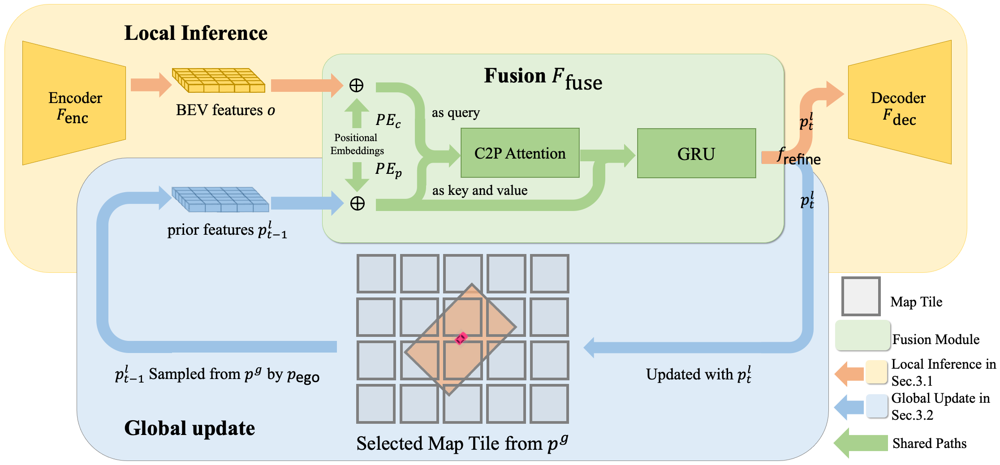

# Neural Map Prior for Autonomous Driving

### [Paper](https://arxiv.org/abs/2304.08481) | [Webpage](https://tsinghua-mars-lab.github.io/neural_map_prior/)

A neural representation of HD maps to improve local map inference performance for autonomous driving.

The official implementation of the paper Neural Map Prior for Autonomous
Driving [[arXiv]](https://arxiv.org/abs/2304.08481) [[CVF]](https://openaccess.thecvf.com/content/CVPR2023/papers/Xiong_Neural_Map_Prior_for_Autonomous_Driving_CVPR_2023_paper.pdf) (
CVPR 2023).

Xuan Xiong, Yicheng Liu, Yuantian Yuan, Yue Wang, Yilun Wang, Hang Zhao

## News

* **2023.07.05:** We release the code and models of neural_map_prior.

## Model Zoo

## Installation

Please check [installation](docs/installation.md) for installation and [data_preparation](docs/data_preparation.md) for
preparing the nuScenes dataset.

## Getting Started

Please check [getting_started](docs/getting_started.md) for training, evaluation, and visualization of neural_map_prior.

## Architecture



## Acknowledgements

This project is mainly based on the following open-sourced
projects: [open-mmlab](https://github.com/open-mmlab), [HDMapNet](https://github.com/Tsinghua-MARS-Lab/HDMapNet), [VectorMapNet](https://github.com/Mrmoore98/VectorMapNet_code/tree/mian).

## Citation

Please consider citing our paper in your publications if it helps your research.

```
@inproceedings{xiong2023neuralmapprior,
  author  = {Xiong, Xuan and Liu, Yicheng and Yuan, Tianyuan and Wang, Yue and Wang, Yilun and Zhao Hang},
  title   = {Neural Map Prior for Autonomous Driving},
  journal = {Proceedings of the IEEE/CVF International Conference on Computer Vision (CVPR)},
  year    = {2023}
}
```

## License

This project is released under the Apache 2.0 license - see the [LICENSE](LICENSE) file for details.

