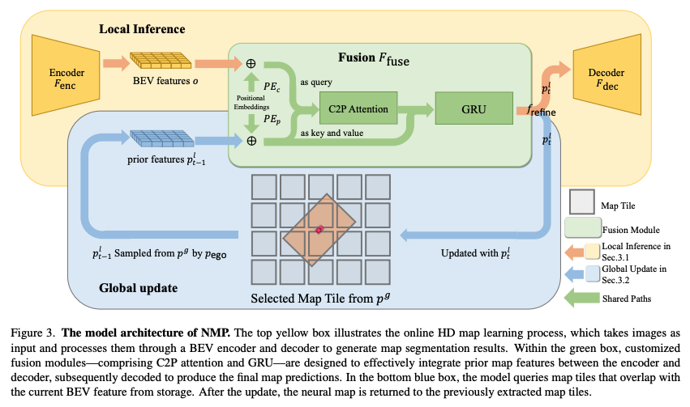

# Neural Map Prior for Autonomous Driving (CVPR 2023)

### [arXiv Paper](https://arxiv.org/abs/2304.08481) | [CVF Paper](https://openaccess.thecvf.com/content/CVPR2023/papers/Xiong_Neural_Map_Prior_for_Autonomous_Driving_CVPR_2023_paper.pdf) | [Webpage](https://tsinghua-mars-lab.github.io/neural_map_prior/) | [5-min video](https://www.youtube.com/watch?v=FpzxaBVw3L0)

[Xuan Xiong](), [Yicheng Liu](https://scholar.google.com.hk/citations?hl=en&user=vRmsgQUAAAAJ), [Tianyuan Yuan](), [Yue Wang](https://people.csail.mit.edu/yuewang/), [Yilun Wang](https://scholar.google.com.hk/citations?user=nUyTDosAAAAJ&hl=en/), [Hang Zhao](http://people.csail.mit.edu/hangzhao/)

## Introduction

A neural representation of HD maps to improve local map inference performance for autonomous driving.

This repo is official implementation of "Neural Map Prior for Autonomous
Driving". Our main contributions are:

* __A novel mapping paradigm__: integrates the __maintenance of global maps__ and
  the __inference of online local maps__.
* __Efficient fusion modules__:  __current-to-prior attention__ and __gated recurrent unit__ modules facilitate
  efficient fusion of global and local map features.
* __Easy integration with existing HD semantic map learning methods__: can be easily applied to various map segmentation
  and detection methods. Moreover, our approach showcases significant advancements in challenging scenarios,
  such as __bad weather conditions__ and __longer perception ranges__.
* __Sparse map tiles__: memory efficient for storing city scale HD maps neural representation.

## Model Zoo

## Installation

Please check [installation](docs/installation.md) for installation and [data_preparation](docs/data_preparation.md) for
preparing the nuScenes dataset.

## Getting Started

Please check [getting_started](docs/getting_started.md) for training, evaluation, and visualization of neural_map_prior.

## Architecture



## Acknowledgements

We are grateful to the entire team at OpenMMLab for creating and maintaining an exceptional open-source
software ecosystem. We would also like to express our gratitude to the entire open-source community for their
continuous support and contributions.

* BEV
  Perception: [BEVFormer](https://github.com/fundamentalvision/BEVFormer), [Lift, Splat, Shoot](https://github.com/nv-tlabs/lift-splat-shoot)
* HD Map
  Learning: [HDMapNet](https://github.com/Tsinghua-MARS-Lab/HDMapNet), [VectorMapNet](https://github.com/Mrmoore98/VectorMapNet_code/tree/mian)
* Vision Transformer: [Swin Transformer](https://github.com/microsoft/Swin-Transformer)
* [open-mmlab](https://github.com/open-mmlab)

The designate `project/nmp` as a module is inspired by the implementations
of [DETR3D](https://github.com/WangYueFt/detr3d).

## Citation

Please consider citing our paper in your publications if it helps your research.

```
@inproceedings{xiong2023neuralmapprior,
  author  = {Xiong, Xuan and Liu, Yicheng and Yuan, Tianyuan and Wang, Yue and Wang, Yilun and Zhao Hang},
  title   = {Neural Map Prior for Autonomous Driving},
  journal = {Proceedings of the IEEE/CVF International Conference on Computer Vision (CVPR)},
  year    = {2023}
}
```

## License

This project is released under the Apache 2.0 license - see the [LICENSE](LICENSE) file for details.

